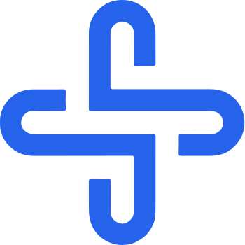

<div align="center">



# Red Médica

**Building trust in healthcare, one IOTA at a time.**

[](https://choosealicense.com/licenses/mit/)
[](https://www.iota.org/products/evm)
[](https://reactjs.org/)
[](https://www.typescriptlang.org/)
[](https://docs.iota.org/developer/iota-evm)

**🚀 Live Demo:** [Red Médica Platform](https://red-medica.vercel.app)  
**📋 Contract (IOTA EVM):** `0xYOUR_IOTA_EVM_CONTRACT_ADDRESS` <!-- TODO: update after deploy -->

</div>

---

## 🎬 See It In Action

<div align="center">

### 📱 Product Registration & IOTA EVM Integration
*4-step registration process with real-time IOTA EVM confirmation*

### 🧾 QR Code Verification System  
*Instant product verification with complete supply chain history from IOTA EVM*

### 📊 Real-time Dashboard Analytics  
*Live product tracking with demo + real data integration*

**✅ Ready for IOTA EVM Mainnet**  
**✅ MetaMask Integration (IOTA EVM)**  
**✅ Frontend ↔ Smart Contract Sync**

</div>

---

## 🚨 The Crisis We're Solving

Every year, **1 million people die** from counterfeit or substandard medicines. The global cost of fake pharmaceuticals exceeds **$200 billion annually**. The medical supply chain is broken, and lives are at stake.

### The Reality on the Ground

| Problem | Impact | Current State |
|--------|--------|---------------|
| 💊 **Counterfeit Drugs** | 10–30% of medicines in developing countries are fake | WHO estimates 1 in 10 medical products is substandard |
| 📉 **Supply Shortages** | 95% of pharmacies experience stockouts monthly | Critical medications never reach rural areas |
| 🔍 **Zero Traceability** | Product recalls take 2–3 weeks on average | Endangers thousands during outbreaks |
| ❌ **Trust Gap** | 67% of patients unsure about medication authenticity | No verification system exists for end-users |
| 💰 **Financial Loss** | $30B lost annually to supply chain inefficiencies | Wasted resources, expired products |

**Red Médica uses IOTA to fix this.**

---

## ✨ Our Solution

Red Médica creates an **immutable chain of trust** from manufacturer to patient using **IOTA EVM** for transparent, tamper-resistant product history, and **Firebase** for real-time UX.

Every medicine bottle, vaccine vial, or medical device gets a **digital passport on IOTA EVM** that follows it through its entire journey.

### 🎯 Core Features

#### 📦 Blockchain Product Registration (IOTA EVM)

```text
🏭 Manufacturer → Creates batch
     ↓
⛓️  Solidity Smart Contract → Records on IOTA EVM
     ↓
🔒 Immutable Record → Verifiable on-chain history
     ↓
🔥 Firebase Sync → Real-time updates to app
What gets recorded on IOTA EVM:

Batch number & unique product ID

Manufacturing date & location

Expiration date

Active ingredients & composition

Regulatory approval numbers

Quality certifications

Temperature requirements

Target distribution regions

🚚 Real-Time Supply Chain Tracking

Each custody transfer is:

Written to IOTA EVM (on-chain event)

Mirrored into Firebase for real-time dashboards and notifications

Example (app-level tracking object):

{
  "productId": "MED-2025-A1B2C3",
  "timestamp": "2025-03-01T14:30:00Z",
  "from": "0xFROM_IOTA_EVM_ADDRESS",
  "to": "0xTO_IOTA_EVM_ADDRESS",
  "location": "Mumbai, India",
  "temperature": "2-8°C ✅",
  "batchQuantity": 10000,
  "status": "In Transit",
  "evmTxHash": "0xtransactionhash"
}


Live notifications via Firebase Cloud Messaging:

📍 Location updates (GPS integration)

🌡️ Temperature monitoring (IoT sensors)

⏰ Expected vs actual delivery times

⚠️ Tampering / anomaly alerts

📝 Customs & clearance status

📱 Instant QR Verification System
<div align="center">
┌─────────────────────────────────────────┐
│  📱 Scan QR Code on Product Packaging  │
└──────────────┬──────────────────────────┘
               │
               ▼
┌─────────────────────────────────────────┐
│   🔍 Query IOTA EVM via Web3 (Ethers)  │
│      + Firebase for cached data        │
└──────────────┬──────────────────────────┘
               │
               ▼
┌─────────────────────────────────────────┐
│  ✅ Display Complete Journey & Status   │
│  • Manufacturer verified                │
│  • N custody transfers recorded         │
│  • All temperature checks passed        │
│  • 0 tampering incidents                │
│  • Expiry: 2026-12-31 ✓                 │
└─────────────────────────────────────────┘

</div>

Anyone can verify:

Healthcare providers

Pharmacists

Patients

Regulators

Insurers

🔄 Complete User Workflows
👨‍🔬 Manufacturer

Login (Firebase Auth)

Connect IOTA EVM wallet (MetaMask)

Create batch (frontend + Firebase)

Register batch on IOTA EVM smart contract

Generate & attach QR codes

Monitor shipments in dashboard

🚛 Distributor / Logistics

Scan & verify incoming shipments

Accept custody (on-chain transfer on IOTA EVM)

Monitor conditions (IoT + Firebase)

Handover to next actor (new on-chain transfer)

💊 Pharmacy

Verify authenticity at goods-in

Manage stock via Firebase

Verify before dispensing to patient

Receive recalls & alerts

👨‍⚕️ Healthcare Provider

Scan before administering

View full chain-of-custody from IOTA EVM

Check recalls / warnings

Report suspicious units

👨‍👩‍👧 Patient

Scan QR with phone

See if medicine is authentic, expired, or recalled

View high-level journey (origin, checkpoints)

Build trust in medication

🛠️ Technical Architecture

Built on IOTA EVM + React/TypeScript + Firebase.

System Architecture
┌──────────────────────────────────────────────────────────┐
│                       FRONTEND (React)                  │
│  • Product registration wizard                           │
│  • QR scanner & verifier                                 │
│  • Analytics dashboard                                   │
└───────────────┬──────────────────────────────────────────┘
                │
┌───────────────▼──────────────────────────────────────────┐
│                    FIREBASE (BaaS)                       │
│  • Auth (Email/Google/etc.)                              │
│  • Firestore (users, products, transfers)                │
│  • Realtime DB (live tracking, alerts)                   │
│  • Cloud Functions (bridge to IOTA EVM)                  │
│  • Cloud Messaging (push notifications)                  │
│  • Storage (QR images, docs)                             │
└───────────────┬──────────────────────────────────────────┘
                │
┌───────────────▼──────────────────────────────────────────┐
│                       IOTA EVM                           │
│  • Solidity smart contract                               │
│      - Product registration                              │
│      - Custody transfers                                 │
│      - On-chain verification                             │
│  • Ethers.js / Web3 integration                          │
│  • IOTA EVM Explorer for verification                    │
└──────────────────────────────────────────────────────────┘

🔗 Technology Stack
Blockchain Layer (IOTA EVM)
Component	Technology	Purpose
Network	IOTA EVM	L2 smart contracts on IOTA
Smart Contracts	Solidity	Supply-chain logic
Web3 Provider	Ethers.js	On-chain interactions
Wallet Integration	MetaMask	User signing / auth
Explorer	IOTA EVM Explorer	Tx & contract inspection
Backend & Realtime

Firebase Auth — auth & roles (manufacturer / distributor / pharmacy / patient)

Firestore — products, transfers, alerts

Realtime DB — live tracking (location, temperature)

Cloud Functions — watch Firestore → write to IOTA EVM & back

Cloud Messaging — push notifications

Frontend

React + TypeScript + Vite

Tailwind CSS + shadcn/ui

QR scanning component

Global state via Zustand (or similar)

Offline-aware local storage for cache

🚀 Quick Start
Prerequisites

Node.js 18+

Git

MetaMask

Firebase project (if using your own backend)

1️⃣ Clone Repo
git clone https://github.com/nikhlu07/Red-Medica.git
cd Red-Medica/red-medica-web
npm install

2️⃣ Configure IOTA EVM

Create .env in red-medica-web/:

# IOTA EVM (Mainnet or Testnet – choose one)
VITE_CONTRACT_ADDRESS=0xYOUR_IOTA_EVM_CONTRACT_ADDRESS
VITE_NETWORK_RPC=https://json-rpc.evm.iotaledger.net
VITE_CHAIN_ID=8822

VITE_APP_NAME="Red Médica"
VITE_APP_VERSION="1.0.0"


ℹ️ For early development, you can switch to IOTA EVM Testnet and adjust RPC/Chain ID accordingly.

3️⃣ Add IOTA EVM to MetaMask

Open MetaMask → Add network

Enter:

Network Name: IOTA EVM

RPC URL: https://json-rpc.evm.iotaledger.net

Chain ID: 8822

Currency Symbol: IOTA

Block Explorer: https://explorer.evm.iota.org

Save & switch to this network.

4️⃣ Run the App
npm run dev
# → http://localhost:5173

🧱 Smart Contract (IOTA EVM, Solidity)

Your previous ink!/Substrate contract is now modelled as a Solidity contract on IOTA EVM.

Example shape (simplified):

// SPDX-License-Identifier: MIT
pragma solidity ^0.8.20;

contract MedicalSupplyChain {
    struct Product {
        uint256 id;
        string batchNumber;
        address manufacturer;
        uint64 mfgDate;
        uint64 expiryDate;
        bytes32 metadataHash; // IPFS hash or similar
        bool isAuthentic;
    }

    struct Transfer {
        address from;
        address to;
        uint64 timestamp;
        string location;
        bool verified;
    }

    address public admin;
    uint256 public nextProductId;

    mapping(uint256 => Product) public products;
    mapping(uint256 => Transfer[]) public transfers;

    event ProductRegistered(uint256 indexed id, address indexed manufacturer);
    event CustodyTransferred(uint256 indexed id, address from, address to);

    constructor() {
        admin = msg.sender;
    }

    function registerProduct(
        string calldata batchNumber,
        uint64 mfgDate,
        uint64 expiryDate,
        bytes32 metadataHash
    ) external returns (uint256) {
        uint256 id = ++nextProductId;

        products[id] = Product({
            id: id,
            batchNumber: batchNumber,
            manufacturer: msg.sender,
            mfgDate: mfgDate,
            expiryDate: expiryDate,
            metadataHash: metadataHash,
            isAuthentic: true
        });

        emit ProductRegistered(id, msg.sender);
        return id;
    }

    function transferCustody(
        uint256 productId,
        address to,
        string calldata location
    ) external {
        Product storage p = products[productId];
        require(p.isAuthentic, "Invalid product");

        transfers[productId].push(
            Transfer({
                from: msg.sender,
                to: to,
                timestamp: uint64(block.timestamp),
                location: location,
                verified: true
            })
        );

        emit CustodyTransferred(productId, msg.sender, to);
    }

    function getTransfers(uint256 productId)
        external
        view
        returns (Transfer[] memory)
    {
        return transfers[productId];
    }

    function verifyProduct(uint256 productId)
        external
        view
        returns (Product memory)
    {
        return products[productId];
    }
}


You can deploy this using Hardhat/Remix pointing at IOTA EVM.

🔐 Security

Role-based access enforced in smart contracts (manufacturer / custodian)

Immutable on-chain history for products and transfers

Firebase security rules to scope what each user can read/write

Private keys stay in wallets (MetaMask); backend uses service keys stored securely

HTTPS everywhere

📈 Roadmap (IOTA Focus)
✅ Phase 1 – IOTA Integration (Hackathon)

 Port core logic to Solidity on IOTA EVM

 Wallet + MetaMask integration for IOTA

 Product registration on IOTA EVM

 Custody transfers & verification on-chain

 QR-based verification dApp

 IOTA EVM-ready architecture & docs

🔄 Phase 2 – Intelligence

 AI-driven demand forecasting & shortage alerts

 IoT sensor integration (temp, humidity, GPS)

 Real-time supply chain risk scoring

 Multi-language support for high-risk regions

🌐 Phase 3 – Ecosystem

 Deeper integration with IOTA tooling & bridges

 DID & verifiable credentials for supply chain actors

 Public APIs & SDKs for hospitals / governments

 Partnerships with health orgs & NGOs

🌍 Why IOTA?

Red Médica is built on IOTA because:

Low fees & scalability → viable for unit-level tracking of medicines

EVM compatibility → reuse existing Solidity tools, Hardhat, MetaMask

Bridging to IOTA L1 (future) → connect real-world assets, identity, and payments

Sustainability → eco-friendly infrastructure for global healthcare

🤝 Contributing

We believe in open-source collaboration. PRs and issues are welcome!

Fork the repo

Create a feature branch

Open a PR with clear description and screenshots (if relevant)

Please be respectful and constructive in all discussions. ❤️

📜 License

This project is licensed under the MIT License.
See LICENSE file for details.

<div align="center">
Built with ❤️ by developers who believe technology can heal

Powered by IOTA EVM • Secured by the Tangle • Scaled with Firebase

</div> ```
